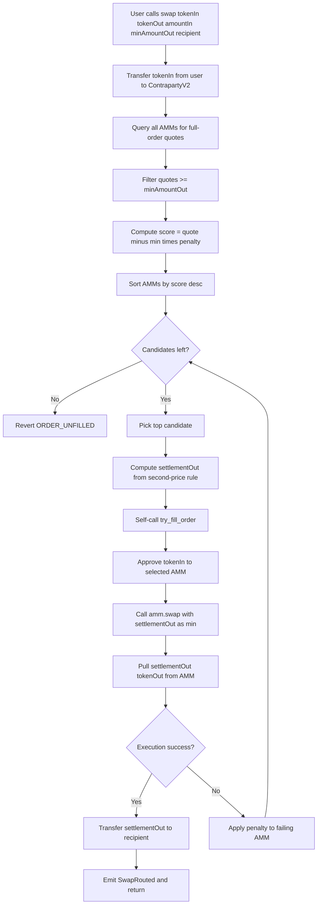

# Contraparty Contracts (Foundry + Vyper)

This directory contains the Vyper contracts and Foundry tests/scripts for `Contraparty` and `ContrapartyV2`.

## ContrapartyV2 Logic

`ContrapartyV2` uses:
- Full-order quote collection from registered AMMs.
- Score per AMM:
  - `score = (quotedAmountOut - minAmountOut) * penaltyCoeff / 1e18`
- Descending score sort.
- Second-price settlement on the winner:
  - `secondHighestScore = score of next candidate`
  - `settlementOut = max(minAmountOut, minAmountOut + secondHighestScore)`
- Self-call execution (`try_fill_order`) with fallback:
  - If an AMM execution fails, that AMM is penalized and the next one is tried.
  - Swap only fails when all candidates fail.

Notes:
- Penalty halves on failed fills.
- Reward-on-overdelivery logic is intentionally removed in V2.
- `quote()` returns the second-highest raw bid for the full order size.
- `swap()` enforces a user-supplied `deadline`.



## Environment

Create local env:

```bash
cp .env.example .env
```

`PRIVATE_KEY` should be set only for broadcast scripts. Do not commit `.env`.

## Build

```bash
forge build
```

## Tests

All tests:

```bash
forge test -vv
```

Fork suites:

```bash
set -a && source .env && set +a
forge test -vv --match-contract ContrapartyForkTest
forge test -vv --match-contract PropAMMVyperForkTest
forge test -vv --match-contract ContrapartyVyperForkTest
forge test -vv --match-contract ContrapartyVyperEndToEndForkTest
forge test -vv --match-contract MegaethForkSmokeTest
forge test -vv --match-contract MegaethQuoterForkTest
forge test -vv --match-contract ContrapartyMegaethForkTest
```
