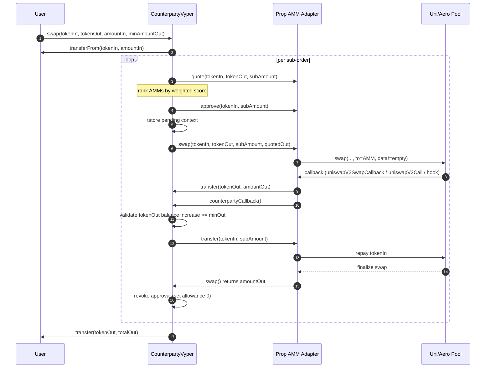

# Counterparty Swap Execution Flow

This diagram explains the callback-based sub-order execution path used by the refactored `CounterpartyVyper` and Vyper Prop AMMs.

## Key Safety Properties

- Input token is released **only after** `Counterparty` verifies output-token balance increase.
- If callback settlement fails, the AMM swap reverts and the sub-order attempt is treated as failed.
- Per-attempt allowance is revoked after each candidate AMM attempt.
- Penalty is reduced on failures and slightly boosted (+1%, capped at 1e18) on better-than-quoted fills.
