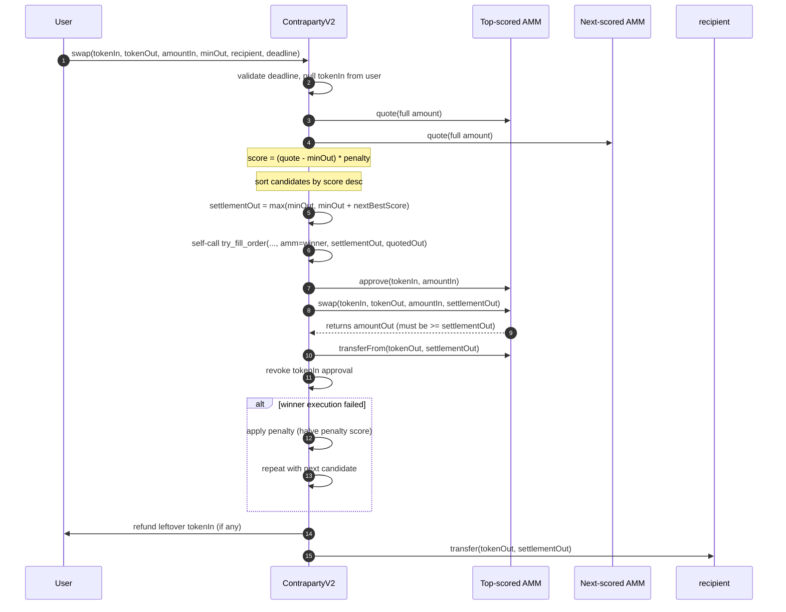

# ContrapartyV2 Swap Execution Flow

This document describes the live `ContrapartyV2` execution flow (single full-order attempt sequence with second-price settlement).

## V2-Specific Properties

- `quote()` returns the **second-highest raw bid** for the full input amount.
- `swap()` enforces user-provided `deadline`.
- Settlement uses second-price logic:
  - `settlementOut = max(minAmountOut, minAmountOut + secondBestScore)`
  - where `secondBestScore = (secondQuote - minAmountOut) * penalty / 1e18`
- The winner must execute at least `settlementOut`, and Contraparty pulls exactly `settlementOut` from the winner.
- If a candidate fails, the transaction does not revert immediately; Contraparty penalizes that AMM and tries the next one.
